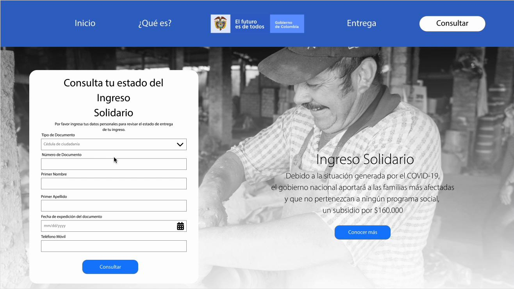
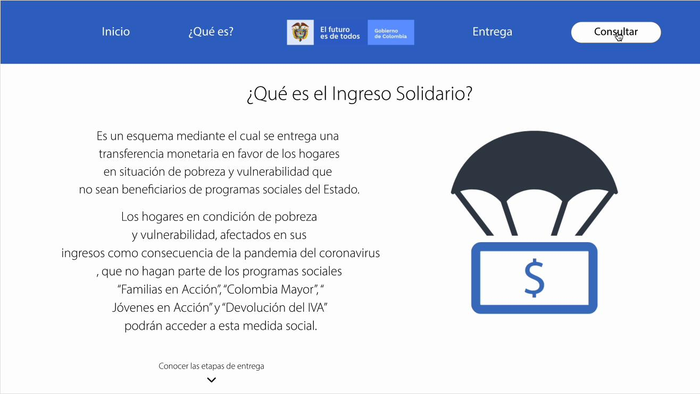
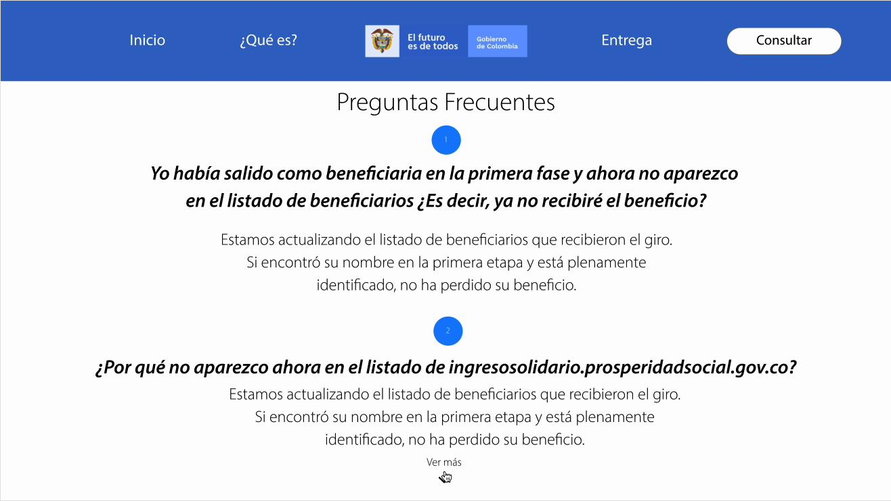

# Ingreso Solidario

Este proyecto es una maqueta responsive para la consulta del programa **Ingreso Solidario** del gobierno. Permite a los ciudadanos consultar su estado de entrega del subsidio mediante un formulario intuitivo y accesible.

## 🌐 Tecnologías Utilizadas

- HTML5
- CSS3 (Flexbox y Media Queries)
- Diseño responsive para móviles, tablets y escritorio

## 📸 Wireframes

### 🖥️ Versión Escritorio

## 🧩 Estructura del Proyecto

IngresoSolidario/
├── index.html
├── styles.css
├── assets/
│ ├── Fondo@2x.png
│ ├── Menu_Bar.png
│ └── wireframe/
│ ├── desktop.png
│ ├── tablet.png
│ └── mobile.png

yaml
Copiar
Editar

## 🧪 Funcionalidades

- Navegación superior con botones destacados
- Formulario para la consulta de beneficiarios
- Información del programa para nuevos usuarios
- Adaptación automática al tamaño de la pantalla

## ✅ Próximas mejoras

- Validación de formularios con JavaScript
- Conexión a base de datos o API simulada
- Accesibilidad mejorada (a11y)

## 📄 Licencia

Este proyecto es de libre uso para fines académicos o de práctica.

---

## 👨‍⚕️ Autor

Desarrollado por **Ing. Cristian Díaz**  
Diseño adaptado y optimizado para propósitos médicos y clínicas.

---

  

